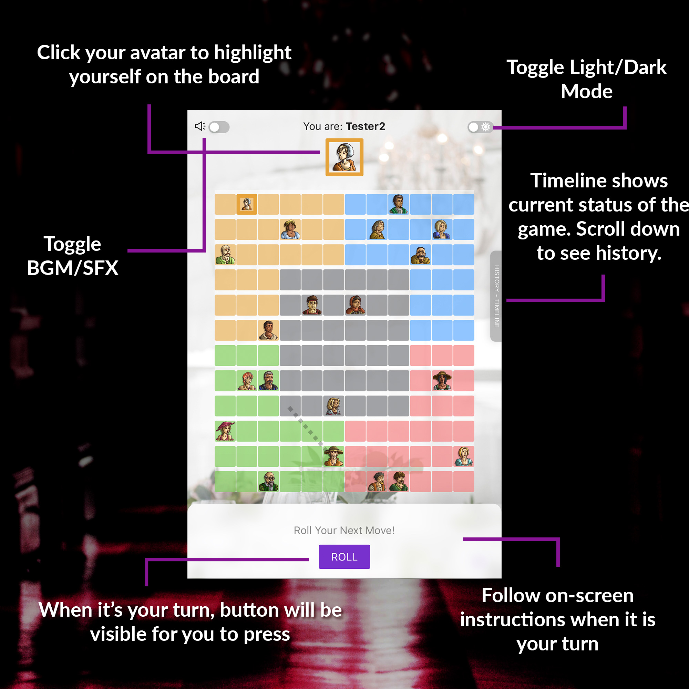

# Welcome To Costume Party 🎉

You are an assassin who has been invited to a costume party. However, your rivals are also invited to the same party! Due to the costumes you all are wearing, you do not know anyone’s identity except your own. Move around in the party, interact with the people in the party, and find out who are your rival assassins, and...

<b style="font-size: 20px; color: #ff6060">KILL THEM ALL 😈 🔫</b>

Grab your party ticket at https://costume-party.web.app and have some fun!

# Game Interface Instructions

# References

The game is inspired by famous board game [Costume Party Assassins](https://www.amazon.com/Playroom-Entertainment-Costume-Party-Assassins/dp/B0799Y5DKQ), to bring this board game to online to play. Game rules are totally following the original board game rules, with only the visual differences.

## Avatar Resources

The avatars used in the game come from [itch.io](https://free-game-assets.itch.io/free-character-avatars) free assets:
https://free-game-assets.itch.io/free-character-avatars

Special thanks to the account: [Free Game Assets](https://free-game-assets.itch.io)

## Sound Resources

The sound used in the game come from the followings:

- Clapping Sound: https://www.youtube.com/watch?v=jDOrc8FmDy4
- Silent Pistol: https://www.youtube.com/watch?v=h6BjmT9anXA
- Walk Sound: https://www.youtube.com/watch?v=3I2pHlBCWFk
- Restaurant BGM: https://www.youtube.com/watch?v=zRrkB2DeqBQ&t=113s

# Release Notes

## Release V1.0

- Basic "Costume Party" game-play and logics
- Game theme and sound effect
- Support day/night theme
- In-game rules can be checked at "Help"
- Animations and highlights to guide the players to choose
- Integration with Firebase Firestore and snapshot listeners

## Release V1.1

- Bugfixes
- Relocate timeline as side-panel drawer for mobile version
- Add notification dialog box on top to notify players' movements
- Animated end-game scene
- Sharable room code as clickable link which will automatically fill up room code for the user
- Dead players will have "dead" status shown to them
